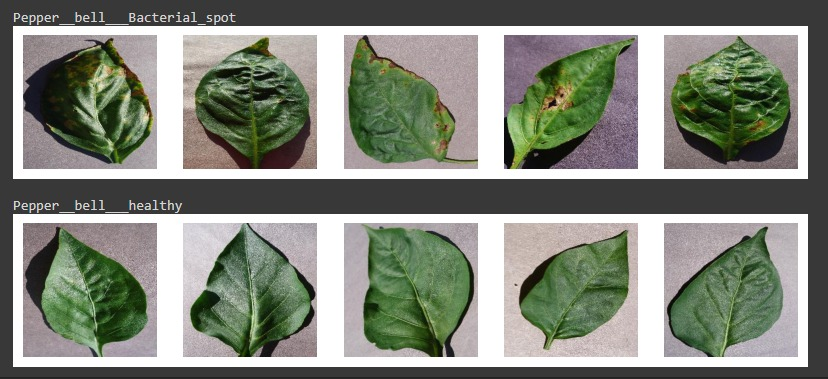
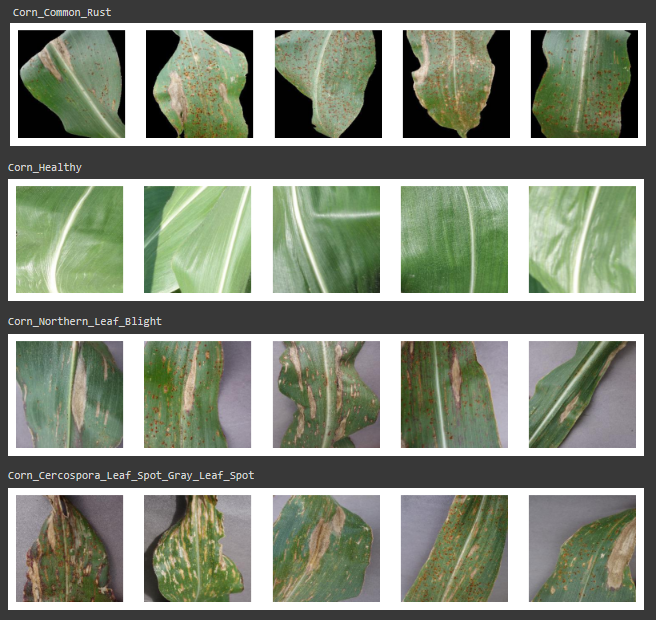

# BotaniScan-ML

## Team Profile
Team ID : C23-PS159 \
\
Our Member : 
1. (ML) Fitrahuda Aulia (M284DSY2506) - Universitas Negeri Medan
2. (ML) Aissa Putri Pertiwi (M295DSY2469) - Universitas Padjadjaran
3. (ML) Carica Deffa Yullinda ( M169DSY2146) - Universitas Gadjah Mada
4. (CC) Rifqi Naufal (C146DSX0903) – Universitas Bengkulu
5. (CC) Rivaldi Arta Wijaya (C146DSX0901) - Universitas Bengkulu
6. (MD) Muhammad Nur Salim (A361DSX3176) – Universitas Terbuka

## Another Github
**Cloud Computing**\
https://github.com/rnaufal52/CC_BotaniScan_C23-PS159 

**Mobile Development**\
https://github.com/nursalim92/MD_BotaniScan_C23-PS159

## BotaniScan
BotaniScan is a plant disease detection application by uploading photos of plant leaves and receiving immediate detection results.
Also this app will give suggestions of stores that provide goods/materials needed to overcome plant diseases that have been detected. The initial release includes three key features: 
1. **Pepper Leaf Disease Prediction**
2. **Corn Leaf Disease Prediction**
3. **Potato Leaf Disease Prediction**

## Machine Learning Deliverables
- Collecting for available datasets
- Finish the Advanced Preprocessing dataset
- Building and testing a baseline model
- Saving the baseline model, advanced preprocessing of data and model optimization

## Dataset Source
[PlantVillage Dataset: Pepper Bell, Corn, and Potato](https://github.com/spMohanty/PlantVillage-Dataset)

### Preview Disease Images

## Documentation
1. Clone this github repository or download zip and extract it 

    

2. Open the ipynb file contained in each folder using google colaboratory
3. Download the dataset and upload it to google drive
   - [Pepper dataset](https://drive.google.com/file/d/1dl0G9o_2UmnSfPGeFLRQwvCwk0s8b4Xr/view?usp=drive_link)
   - [Corn dataset](https://drive.google.com/file/d/1sgbk9HDC3RrqRM16SL4GQ5QWuYWkR4pj/view?usp=drive_link)
   - [Potato dataset](https://drive.google.com/file/d/1DVLQOg8nvr5SnLAG6g7a2tL6jUBxXUlo/view?usp=drive_link)
5. Make sure the path in the code matches the path where the dataset is on google drive
6. Run the code and save the model in .h5 form
